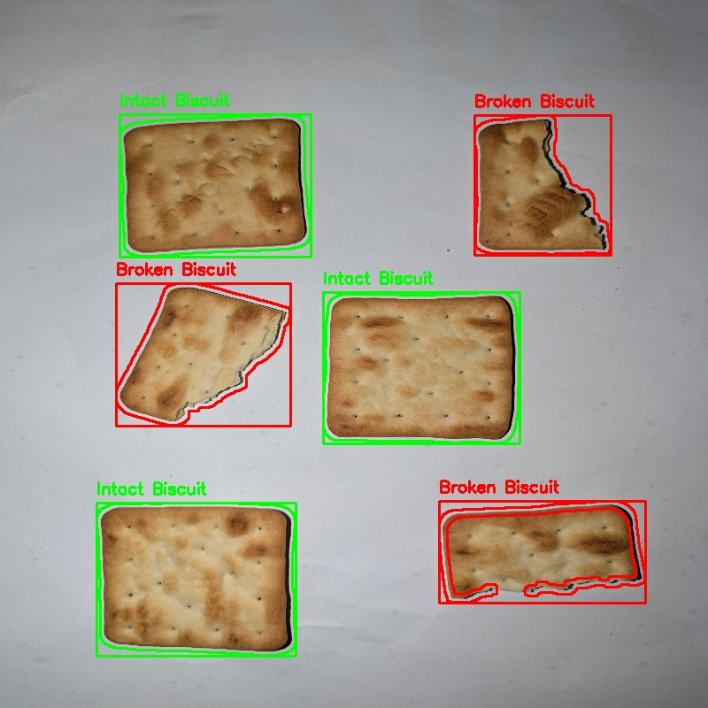
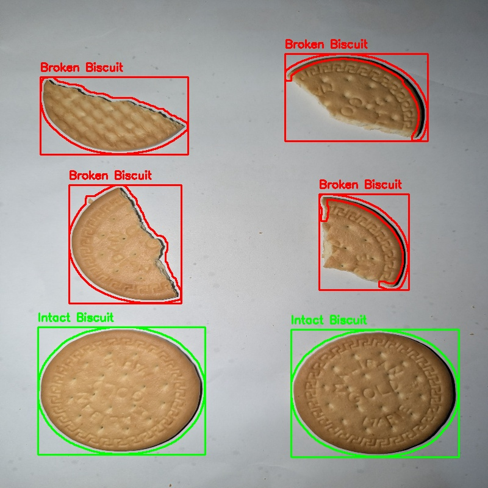

# 🍪 Biscuit Detection and Classification

## 📌 Project Title
Biscuit Detection and Classification (Intact vs Broken) using Classical Image Processing

---

## 📖 Problem Description
The objective of this project is to detect biscuits in images and classify each biscuit as **intact** or **broken**.

This system uses only **classical image processing techniques** such as edge detection, contour detection, and morphological operations. No machine learning or deep learning methods are used.

---

## 🧰 Tools and Libraries Used
- Python  
- OpenCV (cv2)  
- NumPy  
- OS module  

---

## ⚙️ Image Processing Methods Used

The system follows these steps:

### 1. Preprocessing
- Convert image to grayscale  
- Apply Gaussian blur to reduce noise  

### 2. Edge Detection
- Apply Canny edge detection  
- Use automatically calculated thresholds  

### 3. Morphological Operations
- Dilation to strengthen edges  
- Closing operation to fill gaps  

### 4. Contour Filling
- Fill detected contours to obtain solid shapes  

### 5. Contour Detection
- Detect external contours  
- Remove small noise and unwanted regions  

### 6. Feature Extraction
For each biscuit:
- Area  
- Perimeter  
- Circularity  
- Solidity  
- Extent  

### 7. Classification
- **Intact Biscuit**:
  - High circularity, solidity, and extent  
- **Broken Biscuit**:
  - Does not satisfy the above conditions  

### 8. Annotation
- Draw contours and bounding boxes  
- Label each biscuit as:
  - *Intact Biscuit*  
  - *Broken Biscuit*  

---

## ▶️ Instructions to Run the Code
1. Place input images in the `input` folder  
2. Run the code:

python main.py

3. Output images will be saved in the `output` folder  

---

## 🧪 Example Output Images

### Output
- Biscuits detected using contours  
- Bounding boxes drawn around each biscuit  
- Each biscuit labeled as:
  - **Intact Biscuit**
  - **Broken Biscuit**

---
